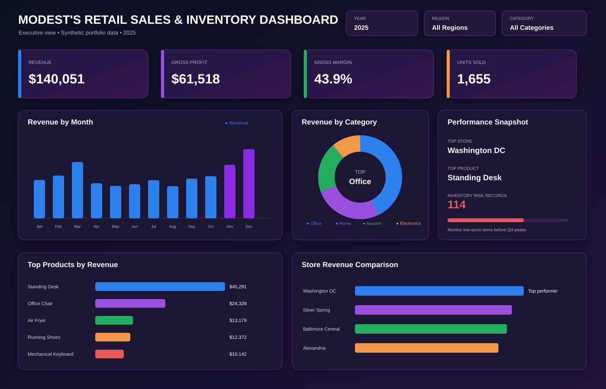
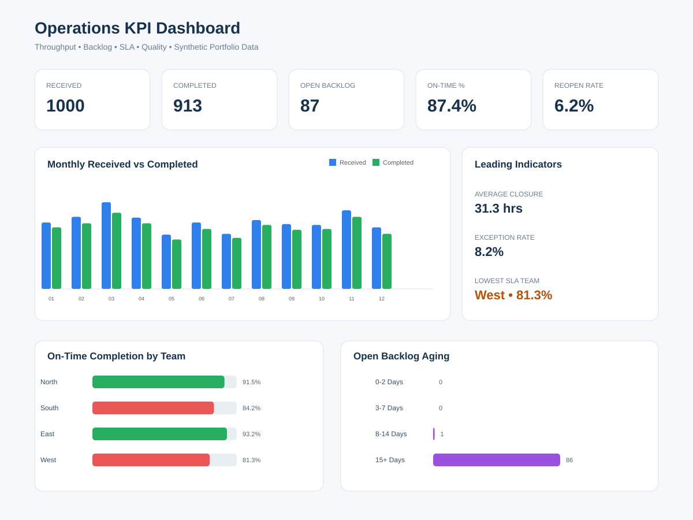
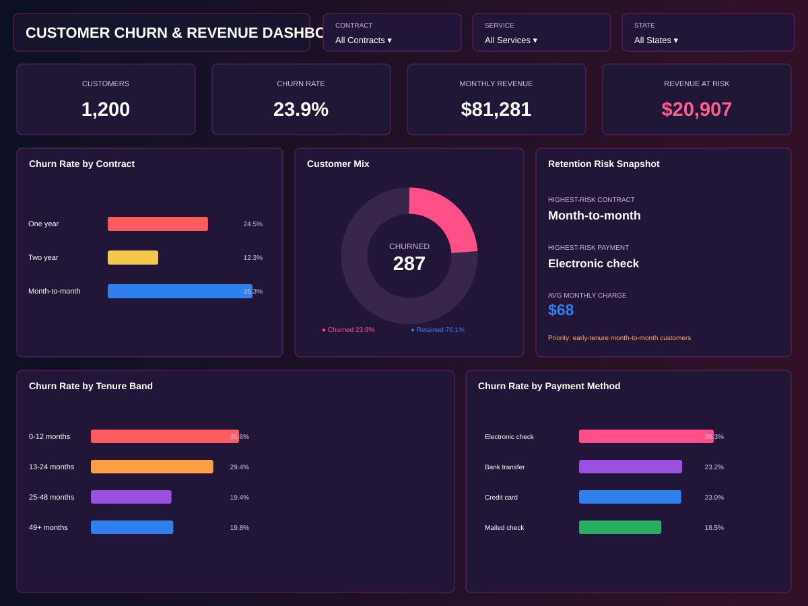
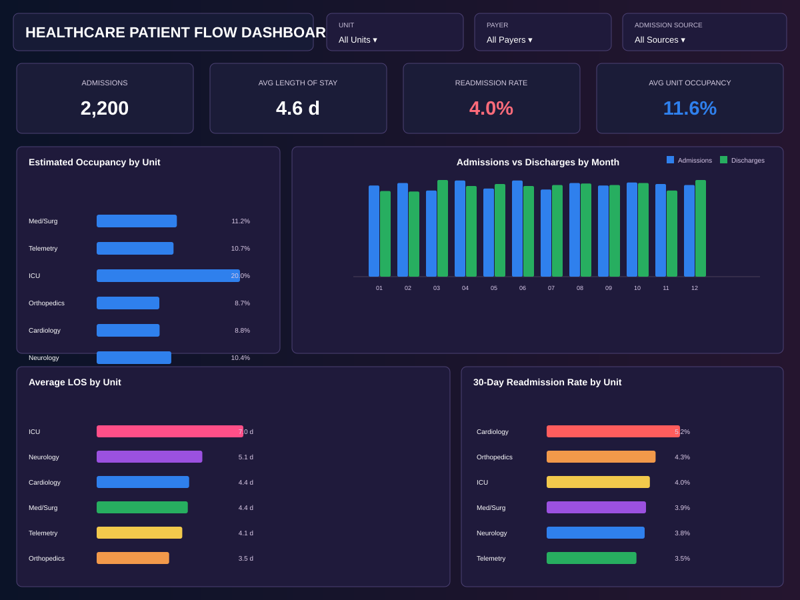
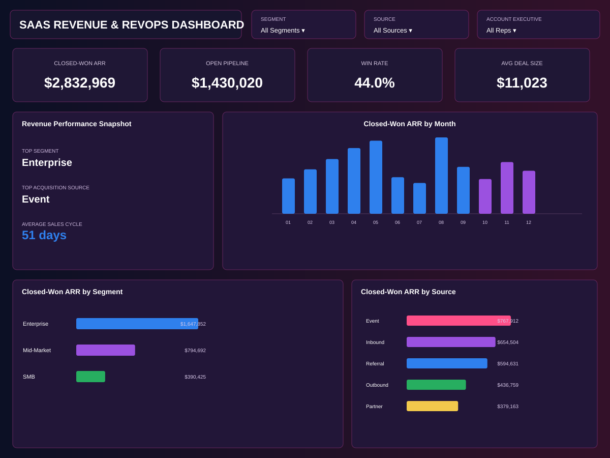

# Modest Kamgang — Data Analyst & Business Intelligence Portfolio\n\n**SQL • Power BI • Tableau • Python • Snowflake • Excel • ETL • KPI Design • Reporting Automation**\n\nI build analytics solutions that connect **business questions → trusted metrics → actionable decisions**. This portfolio combines synthetic datasets, SQL/Python analysis, dashboard design, business insights, and executive recommendations across multiple industries.\n\n## Portfolio Website\n**GitHub Pages site:** https://kamgangmodest.github.io/data-analyst-portfolio/\n\n## What I Deliver\n- **SQL Analysis:** complex joins, CTEs, window functions, reusable logic, validation, and root-cause analysis\n- **Executive Dashboards:** Power BI / Tableau-style KPI reporting designed for decision makers\n- **Automation:** Python, SQL procedures, ETL, and recurring-report workflows\n- **KPI Design:** business definitions, SLA logic, leading indicators, thresholds, and scorecards\n- **Data Quality:** reconciliation, missing/duplicate detection, source-to-report checks\n- **Stakeholder Reporting:** requirements gathering, analytical storytelling, and recommendations\n\n## Featured Skills\n`SQL` `Power BI` `Tableau` `Python` `Snowflake` `Excel` `Azure Data Factory` `SSIS` `Power Query` `DAX` `pandas` `R` `SQL Server` `ETL` `Data Modeling`\n\n---\n\n## 1. Retail Sales & Inventory Performance\n\n\n**Tools:** SQL • Power BI  \n**Problem:** Identify revenue drivers and inventory risks across stores and products.  \n**Result:** Analyzed **$140K in synthetic revenue**, identified Washington DC as the strongest store, and built KPI reporting around revenue, profit, category mix, product performance, and inventory risk.  \n**Business impact:** Converts sales and stock signals into replenishment and product-mix actions.\n\n[Case Study](projects/retail-sales-analysis/README.md) • [Interactive Demo](projects/retail-sales-analysis/dashboard/interactive.html)\n\n---\n\n## 2. Operations KPI & SLA Dashboard\n\n\n**Tools:** SQL • Power BI / Tableau  \n**Problem:** Detect SLA risk before month-end rather than after a miss.  \n**Result:** Modeled **1,000 work items**, **87-item backlog**, and **87.4% on-time completion** with aging, reopen, exception, and productivity analysis.  \n**Business impact:** Helps managers prioritize old backlog and intervene before service levels deteriorate.\n\n[Case Study](projects/operations-kpi-dashboard/README.md) • [Interactive Demo](projects/operations-kpi-dashboard/dashboard/interactive.html)\n\n---\n\n## 3. Customer Churn & Revenue Analysis\n\n\n**Tools:** Python • pandas • BI  \n**Problem:** Determine who is most likely to churn and quantify the revenue exposure.  \n**Result:** Analyzed **1,200 customers**, **23.9% churn**, **$81K monthly revenue**, and **$20.9K monthly revenue at risk**.  \n**Business impact:** Focuses retention on high-risk contract, tenure, service, and payment segments.\n\n[Case Study](projects/customer-churn-analysis/README.md) • [Interactive Demo](projects/customer-churn-analysis/dashboard/interactive.html)\n\n---\n\n## 4. Healthcare Patient Flow Analysis\n\n\n**Tools:** SQL • Power BI  \n**Problem:** Surface capacity, LOS, flow, and readmission risks.  \n**Result:** Analyzed **2,200 synthetic encounters**, **4.6-day average LOS**, and **4.0% readmission rate** across hospital units.  \n**Business impact:** Supports targeted review of long stays, unit pressure, and readmission patterns.\n\n[Case Study](projects/healthcare-patient-flow/README.md) • [Interactive Demo](projects/healthcare-patient-flow/dashboard/interactive.html)\n\n---\n\n## 5. SaaS Revenue & RevOps Analytics\n\n\n**Tools:** SQL • Finance Analytics • RevOps  \n**Problem:** Connect pipeline, ARR, win rate, sales cycle, segment, and acquisition-source performance.  \n**Result:** Modeled **$2.83M closed-won ARR**, **$1.43M open pipeline**, and **44.0% win rate**.  \n**Business impact:** Helps revenue leaders focus on high-value segments, stronger acquisition channels, and pipeline quality.\n\n[Case Study](projects/saas-revenue-revops/README.md) • [Interactive Demo](projects/saas-revenue-revops/dashboard/interactive.html)\n\n---\n\n## Professional Experience Snapshot\nMy professional background includes:\n- **Healthcare analytics:** patient flow, utilization, quality, capacity, and leadership reporting\n- **Operations & finance analytics:** SLA, throughput, productivity, backlog, and business performance reporting\n- **Business intelligence & automation:** SQL, Power BI, Tableau, Python, ETL, validation, and recurring reporting workflows\n\n## Resume & Contact\n- [Portfolio Resume](resume.html)\n- [LinkedIn](https://www.linkedin.com/in/modest-kamgang)\n- [GitHub](https://github.com/kamgangmodest)\n- Email: **modkamgang@gmail.com**\n\n## Interactive BI Note\nThis repository includes browser-based interactive demos for portfolio review. Direct Tableau Public / Power BI Service buttons should only be added when those reports have been published to public BI accounts; no public Tableau or Power BI URL is fabricated here.\n\n## Data Privacy\nAll portfolio datasets are **synthetic or public-use portfolio data**. No employer-confidential records, PHI, customer data, or proprietary schemas are included.